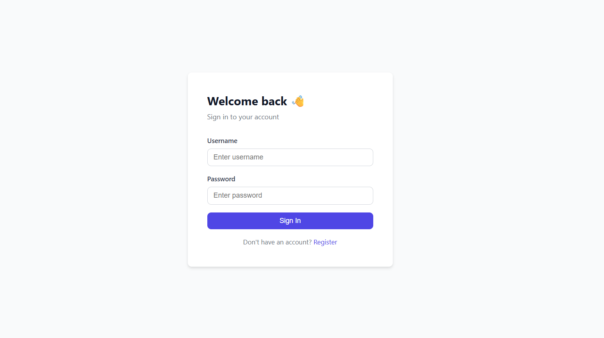
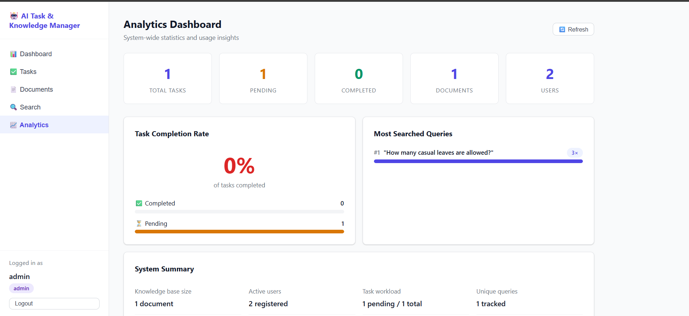

# AI-Powered Task & Knowledge Management System

An enterprise-style knowledge management platform built with FastAPI, React, and MySQL. Administrators can upload documents and assign tasks, while users perform AI-powered semantic searches over the knowledge base and complete assigned work. The project uses local embeddings with FAISS for semantic retrieval, JWT authentication, Role-Based Access Control (RBAC), activity logging, and analytics.

---

## Tech Stack

| Layer | Technology |
|---|---|
| **Backend** | Python 3.11, FastAPI, SQLAlchemy ORM |
| **Database** | MySQL 8.0 (relational schema, PK/FK constraints) |
| **Auth** | JWT (python-jose), bcrypt password hashing, RBAC middleware |
| **AI / Embeddings** | fastembed (ONNX Runtime) — `BAAI/bge-small-en-v1.5`, 384-dim |
| **Vector DB** | FAISS (`IndexIDMap + IndexFlatIP`) with JSON sidecar for metadata |
| **PDF extraction** | pypdf |
| **Frontend** | React 19, React Router v7, Axios |
| **Containerisation** | Docker + Docker Compose |

> **No external LLM API** is used for core search logic. Embeddings are computed locally using ONNX Runtime via `fastembed`.

---

## Project Structure

```
project/
├── backend/
│   ├── app/
│   │   ├── ai/
│   │   │   ├── embeddings.py       # fastembed wrapper (local inference)
│   │   │   ├── text_extraction.py  # .txt / .pdf text + chunking
│   │   │   └── vector_store.py     # FAISS index with persistence
│   │   ├── models/
│   │   │   ├── user.py             # users + roles tables
│   │   │   ├── document.py         # documents table
│   │   │   ├── task.py             # tasks table
│   │   │   └── activity_log.py     # activity_logs table
│   │   ├── schemas/                # Pydantic request/response models
│   │   ├── services/               # Business logic layer
│   │   ├── routers/                # FastAPI route controllers
│   │   ├── config.py               # Centralised env-driven config
│   │   ├── database.py             # SQLAlchemy engine + session
│   │   ├── security.py             # JWT + bcrypt helpers
│   │   ├── dependencies.py         # FastAPI deps: get_current_user, require_role
│   │   ├── main.py                 # App entrypoint, CORS, router wiring
│   │   └── seed.py                 # Bootstrap roles + default admin
│   ├── storage/
│   │   ├── uploads/                # Uploaded document files
│   │   └── vector_index/           # FAISS index.faiss + metadata.json
│   ├── requirements.txt
│   
├── frontend/
    ├── src/
    │   ├── api/                    # Axios client + per-domain API helpers
    │   ├── context/AuthContext.jsx # Global auth state (React Context)
    │   ├── components/             # Sidebar, ProtectedRoute
    │   └── pages/                  # Login, Register, Dashboard, Tasks,
    │                               #   Documents, Search, Analytics
    ├
    └── nginx.conf

```

---

## Database Schema

```
roles          users               tasks
──────         ─────               ─────
id (PK)        id (PK)             id (PK)
name           username            title
               email               description
               password_hash       status (pending|completed)
               role_id (FK→roles)  assigned_to (FK→users)
               created_at          created_by (FK→users)
                                   created_at
                                   updated_at

documents                          activity_logs
─────────                          ─────────────
id (PK)                            id (PK)
filename                           user_id (FK→users)
filepath                           action
file_type                          details
content_text                       timestamp
uploaded_by (FK→users)
uploaded_at
vector_ids
```

---

## Setup & Running

#### MySQL

```sql
CREATE DATABASE ai_task_km CHARACTER SET utf8mb4 COLLATE utf8mb4_unicode_ci;
CREATE USER 'km_user'@'localhost' IDENTIFIED BY 'km_password';
GRANT ALL PRIVILEGES ON ai_task_km.* TO 'km_user'@'localhost';
FLUSH PRIVILEGES;
```

#### 2. Backend

```bash
cd backend/
python -m venv venv
source venv/bin/activate        # Windows: venv\Scripts\activate
pip install -r requirements.txt

# Copy and edit environment variables
cp .env.example .env
# Edit .env with your MySQL credentials and JWT secret

# Seed the database (creates roles + default admin)
python -m app.seed

# Start the API server
uvicorn app.main:app --reload --host 0.0.0.0 --port 8000
```

The embedding model (`BAAI/bge-small-en-v1.5`, ~130 MB) downloads automatically on first use.

#### 3. Frontend

```bash
cd frontend/
npm install
REACT_APP_API_URL=http://localhost:8000 npm start
```

---

## API Reference

| Method | Endpoint | Auth | Role | Description |
|--------|----------|------|------|-------------|
| POST | `/auth/register` | No | — | Create new user |
| POST | `/auth/login` | No | — | Login → JWT token |
| GET | `/auth/me` | Yes | any | Current user info |
| GET | `/auth/users` | Yes | admin | List all users |
| POST | `/tasks` | Yes | admin | Create & assign task |
| GET | `/tasks` | Yes | any | List tasks (dynamic filter) |
| GET | `/tasks?status=completed` | Yes | any | Filter by status |
| GET | `/tasks?assigned_to=1` | Yes | admin | Filter by user |
| PATCH | `/tasks/{id}/status` | Yes | any | Update task status |
| POST | `/documents` | Yes | admin | Upload .txt / .pdf |
| GET | `/documents` | Yes | any | List all documents |
| POST | `/search` | Yes | any | Semantic search |
| GET | `/analytics` | Yes | admin | Dashboard analytics |
| GET | `/health` | No | — | Health check |

---

## Key Highlights

- JWT Authentication with Role-Based Access Control (Admin/User)
- AI-powered semantic search using local embeddings (FAISS + FastEmbed)
- MySQL relational database with proper PK/FK relationships
- Activity logging for login, document upload, search, and task updates
- Analytics dashboard with task statistics
- Docker support for one-command deployment

## Features

### Authentication & RBAC
- JWT bearer tokens; token payload contains `user_id` and `role`
- `require_role("admin")` dependency guards admin-only endpoints
- Non-admin users auto-scoped to their own tasks at the data layer

### AI Semantic Search (core requirement)
1. On document upload: text extracted → chunked (500 words, 50-word overlap) → each chunk embedded via `BAAI/bge-small-en-v1.5` → stored in FAISS `IndexIDMap(IndexFlatIP)` (inner-product on L2-normalised vectors = cosine similarity)
2. On search: query embedded with the same local model → nearest-neighbour lookup in FAISS → top-K chunks returned with similarity scores
3. **No external API calls** during retrieval — everything runs in-process via ONNX Runtime

### Activity Logging
All key actions are recorded in `activity_logs`: `login`, `task_update`, `document_upload`, `search`

### Analytics
- Total / completed / pending task counts
- Total documents and users
- Most-searched queries (with counts, from activity_logs)

---

## Screenshots

## Screenshots

### Login Page



### Dashboard



| Page | Description |
|------|-------------|
| Login | JWT auth with username/password |
| Dashboard | Role-aware quick stats + recent items |
| Tasks | Full task table with dynamic status filter + admin create modal |
| Documents | Drag-and-drop upload zone + document list |
| Search | Semantic search with keyword highlighting + similarity scores |
| Analytics | Charts for task completion rate + most-searched queries |
